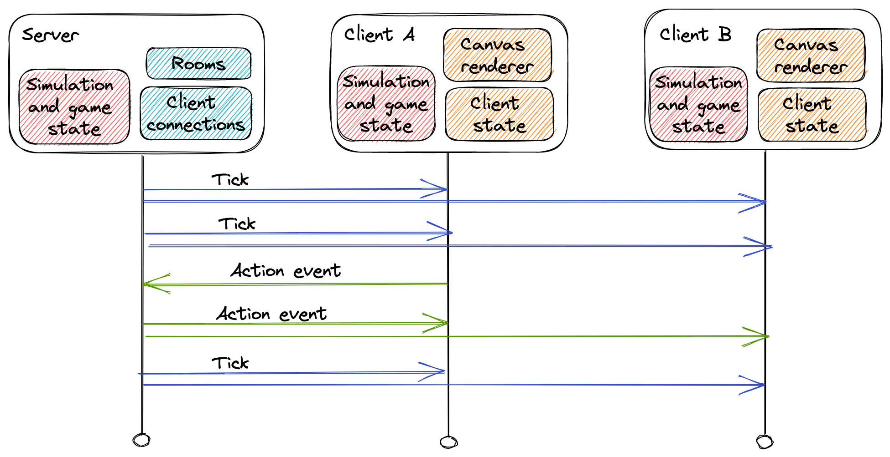
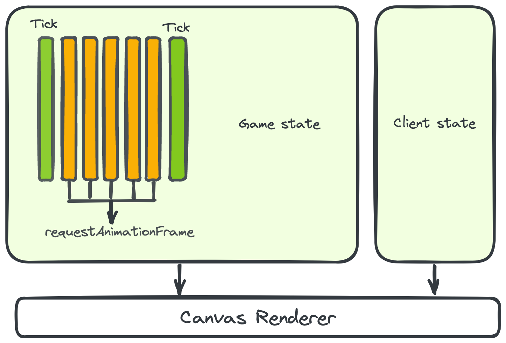

# AOE2 MicroMania

This project is an implementation of a tiny subset of [Age of Empires II](https://en.wikipedia.org/wiki/Age_of_Empires_II) gameplay, written in TypeScript
inspired by the classic scenario [MicroMania](https://www.voobly.com/gamemods/mod/475/MicroMania).

Implemented features include:

* Single player and multiplayer
* Attack move
* Formations
* Control groups
* Shift-queue
* Isometric map with terrain
* Configurable hotkeys
* Lobby system
* Recorded games
* Spectating

## Demos

* [Static demo](https://micromania-aoe2.github.io/) (no server component)
* [Live demo](https://main-bvxea6i-5gx6ejvclv6ua.au.platformsh.site/) (running server but may go offline)

## Architecture

The goal of this project is to create a new implementation of an extremely small subset
of features provided by the genie engine. It uses the [smx file format](https://github.com/Sam152/genie-smx)
for assets and attempts to implement concepts like: attack frame delay, range, reload time, min/max range -
available in the original engine.

The entire game state is represented as a single object. Any changes to the game state are made by mutating it
with an action. The most frequently dispatched action is a "tick", which increments the game simulation.

### Networking

The orchestration of state can happen locally for single player or be coordinated by the server. The server
will receive actions that clients wish to dispatch, validate them and send them back to each connected client
to run against their own local simulation.

This keeps all clients in sync (given the simulation remains totally deterministic), since even for their own actions
they must wait for the action received by the server to commit them to the simulation (ie the order of actions
relative to ticks is the same for all clients).

### Client state and rendering

In addition to the game state, each client has its own client state, which is information that is non-essential
for other clients to recreate the game state. It may include things like, the units that are selected, the position
of the mouse, control groups and the camera viewport. This object works in a similar way in that actions made by the client
(panning the camera, clicking a unit etc.) are dispatched into a function which mutates the local state.

The renderer takes both the client state and the game state and produces the visual representation of both
that is ultimately displayed to the user.

Since the game simulation runs at a low fixed number of ticks per second (20), the renderer will also estimate the
framerate of the client and interpolate the position of on-screen items by the fraction of the tick each frame has
progressed. This allows the game to run at the maximum fps supported by the display while maintaining the same deterministic
game state across clients.

# Legal

Age of Empires II © Microsoft Corporation. This repo was created under Microsoft's "[Game Content Usage Rules](https://www.xbox.com/en-us/developers/rules)" using assets from Age of Empires II, and it is not endorsed by or affiliated with Microsoft.  

